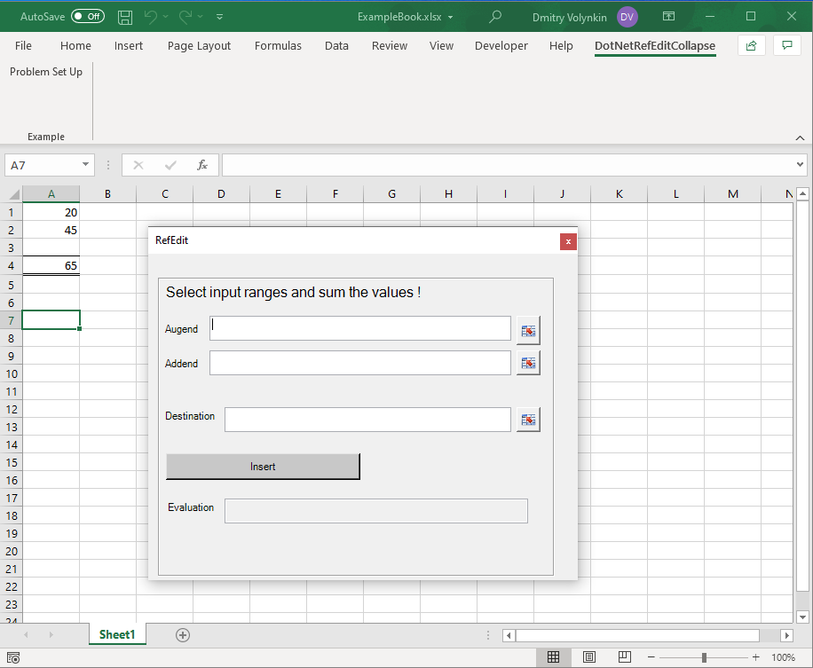
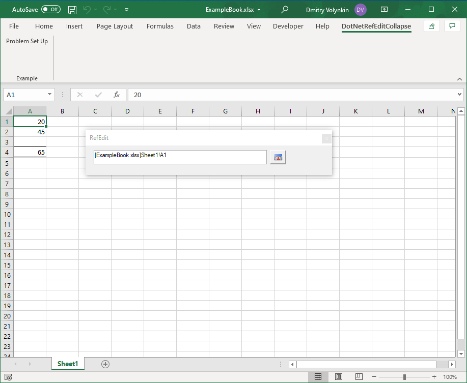
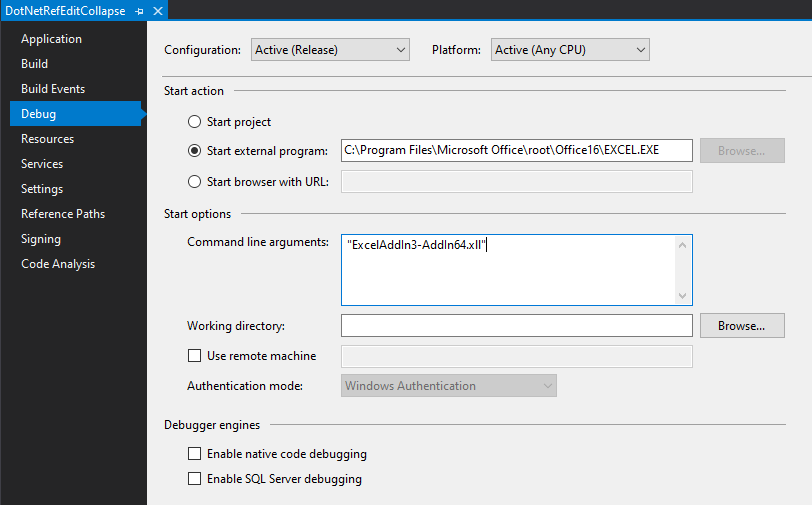

2021-04-04

# Introduction

In working with Excel it is commonly required for the user to input a cell reference for your AddIn to obtain some data and work with that reference further.

An example where a typical Excel user would come across such functionality is in the insert formula capability of Excel, where buttons are clicked in order to select specific cells:

Excel's Solver AddIn is another example where such controls are used.

If you want to make your own versions of such controls, then unfortunately there isn't an out of the box solution that can be dragged and dropped into your C# AddIn. Various attempts are available on the web, however each of them has its own limitations.

In this repo I've taken [another project](https://github.com/Ron-Ldn/DotNetRefEdit) and have made my own attempt to emulate this behaviour. I hope this provides a minimal example that anyone can take and create such controls for their own projects.

# How to Use

## How to Install Example
Take either the "RefEdit_ExcelAddIn3-AddIn-packed.xll" or "RefEdit_ExcelAddIn3-AddIn64-packed.xll" (depending on your 32-bit or 64-bit system respectively) from [https://github.com/dimvoly/DotNetRefEditCollapse](https://github.com/dimvoly/DotNetRefEditCollapse).

Add to Excel via `Developer > Add-ins > Excel Add-ins > Browse` and select the .xll file.

## Example Usage
Open up a workbook that has two values you want to insert the sum function to.
Go to `DotNetRefEditCollapse > Example > Problem Set Up`.

Click the button to the right of "Augend" to collapse the form and then select cell A1.

Click either the uncollapse button, or hit enter to return to the form.
Repeat for the other two cells, and then click Insert to put the sum function into the Destination cell.

## How to Install Code and Run From VS
Either download the code and open as a solution or clone the repo using the Visual Studio GitHub plug-in. Use the following debug options to load the add-in after compilation:

You'd likely want to just copy out the relevant parts to your code, this isn't something that you can clone and use as a component - too many things are intertwined to make it work.

# Limitations
This isn't a standalone Control and the code isn't well encapsulated at all. Any specific suggestions that would help make this a better example are certainly welcome, please post them as issues with what you propose.

# Other Approaches & References
- [Ron-Ldn's Example](https://github.com/Ron-Ldn/DotNetRefEdit) I've taken the non threaded WinForms example off of here and used it as my base. Unfortunately the separate thread approaches do not work anymore with the latest ExcelDNA due to [this check](https://github.com/Excel-DNA/ExcelDna/pull/270).
- [Bart's Example](https://github.com/MrBeee/XlDialogBox/tree/master). This was posted as a reply to my queries on the [ExcelDNA](https://groups.google.com/g/exceldna/c/RQ-xLW1A4NI/m/z5ZVESTWCQAJ) Google Group.
- [zwq's approach](https://github.com/zwq00000/ExcelDna-XlDialog). I have not tested this.

# Acknowledgments
Big thanks to Govert for his help and of course for the wonderful [Excel-DNA](https://github.com/Excel-DNA/ExcelDna) project.
